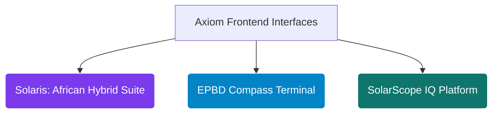

# <p align="center">Axiom Infrastructure Intelligence LLP</p>

<div align="center">
  <h1>Tinashe (Bethel) Nedi</h1>
  <p><strong>Founder &amp; Principal Structural Energy Engineer</strong></p>
  <p><em>Engineering Deterministic, Physics-Based Microservices &amp; Web Interfaces for Global Infrastructure Underwriting, Building Physics, and Statutory Decarbonization Liabilities</em></p>
</div>

<div align="center">
  <a href="https://rapidapi.com/user/bethelnedi"></a>
  <a href="https://www.postman.com/bethelnedi-5769756/solartruth-energy-apis/"></a>
  
  
</div>

---

## ⚡ Computational Engineering Philosophy

I eliminate engineering debt, subjective assumptions, and loose spreadsheet heuristics from global infrastructure development and commercial real estate underwriting. Transaction, investment, and asset management teams frequently try to manage multi-million-dollar portfolios using static, disconnected Excel models or qualitative PDF audits. While Excel is a powerful financial ledger, it is a terrible thermodynamic, structural, or regulatory computation engine.

Through **Axiom Infrastructure Intelligence LLP**, I bridge the gap between building physics, local statutory frameworks, and institutional capital gates. I develop and deploy low-latency, production-grade microservices (**Python/FastAPI**) that run forensic risk, structural load, and thermodynamic yield audits across property pipelines. If an asset cannot clear a bankable credit committee or pass strict structural compliance verification using our data arrays, we do not ship the endpoint.

---

## 🏛️ Programmatic Microservice Ecosystem (API Core)

### 🔋 1. Utility Infrastructure, Electrochemical Storage & Fleet Electrification
* **Solar + BESS Sizing & Dispatch Optimization API** (`POST /bess/optimal`) — Resolves non-linear battery energy storage system optimization matrices. Simulates behind-the-meter load duration curves, peak-shaving demand algorithms, and state-of-health (SOH) calendar/cycle degradation functions bound to **NREL ATB 2024**, **PNNL-33283**, and **IRA 2022 §48E** tax structures.
* **Solar O&M Performance Monitoring API** — Computes age-adjusted, weather-corrected performance ratios according to **IEC 61724-1:2021 §8.2** to strip away seasonal thermal distortion from production streaming, isolating true degradation rates via **Jordan & Kurtz (NREL)** baselines.
* **Solar + EV Integration Sizing API** — Coordinates multi-variant sizing frameworks for corporate/fleet co-location, balancing localized dynamic EV charging profiles against solar self-consumption curves and bidirectional V2H/V2G constraints.
* **Residential & C&I Solar ROI API** — Ingests localized geographic constraints and utility bills to execute comprehensive 25-year financial risk underwriting (NPV, IRR, LCOE via Newton-Raphson), mapping complex multi-tier utility tariffs and net-billing policy metrics (such as post-April 2023 **California NEM 3.0** rules).

### 🏢 2. Building Physics & Building-Integrated Photovoltaics (BIPV)
* **BIPV Energy Yield Engine API** — Synthesizes high-fidelity structural building facade and roof solar physics modeling using **HDKR diffuse horizontal irradiance transposition models**, ventilated facade thermal boundary equations, and **Sandia cell temperature transformations (King et al.)** driven by **NASA POWER MERRA-2** historical climate grids.
* **BIPV Structural Wind Load API** — Processes Ultimate Limit State (ULS) and Serviceability Limit State (SLS) loading vectors on architectural building skins. Computes structural combination equations (**EN 1990 Combo 6.10b**) and localized external wind pressure coefficients (**Cpe zones per EN 1991-1-4:2005** and **ASCE 7-22**) to mathematically validate vertical facade bracket pullout safety margins and boundary layer aerodynamics.
* **Rooftop Solar Suitability API** — Leverages programmatic open-source GIS polygon ingestion maps (`OpenStreetMap`) to extract building boundaries via the Shoelace formula, automatically applying NREL usable fractions and mandatory 1-meter perimeter fire setbacks (**IFC 2021 §1504.3**) to verify clean building areas.

### 📜 3. Decarbonization, Performance Standards (BPS) & Sovereign Policy Tracking
* **Energy Audit Automation API** (`POST /audit/full`) — Normalizes building Energy Use Intensity (EUI) metrics against **EPA ENERGY STAR Portfolio / CBECS 2018** benchmarks to automate ASHRAE-aligned algorithmic compliance tracking.
* **Urban Carbon Penalty Mitigation API** — Programmatically screens building asset exposure across major North American municipal frameworks (**NYC Local Law 97, Boston BERDO 2.0, Energize Denver**). Computes real-time carbon emissions trajectories and exact financial penalty exposure in dollars across current and 2030 cycles.
* **EPBD Compliance & Building Renovation API** — Formulates asset-level structural energy rating transitions (EPC steps A-G) mapped to the European Union's **Energy Performance of Buildings Directive (EPBD 2024/1275)** framework.

---

## 🛠️ Integrated Automated Software Tools (Interfaces)

Axiom deploys three headless production sandboxes that act as direct web interfaces for our calculation microservices. These interfaces turn fragmented regulatory and physical criteria into interactive, investment-grade screening dashboards:



---

### 🌍 1. Solaris: Diesel-to-Solar Hybrid Feasibility Suite

A free, open-core techno-economic optimization sandbox built to replace slow, manual consulting loops with instant pre-feasibility tracking. Users bring their own RapidAPI key to run intensive asset-level analysis.

* **Sovereign Scope:** Pre-configured for **10 core African markets**: Nigeria, South Africa, Kenya, Ghana, Egypt, Tanzania, Ethiopia, Zambia, Senegal, and Morocco.
* **Commercial & Industrial Sector Logic:** Ingests dynamic load profiles across **8 high-demand sectors**: Manufacturing, Hospitals, Cold Chain, Telecom Towers, Hotels, Retail, Commercial Offices, and Agro-processing.
* **Engine Determinism:** Charts hourly merit-order physical dispatch loops (Solar → BESS → Grid → Diesel), enforces **ISO 8528-1:2005 §13** generator wet-stacking protection curves (30% nameplate load limit floor), evaluates non-linear cell State-of-Health (SOH), and verifies cash flows against mandatory institutional **IFC 1.30 DSCR** underwriting covenants.

### 🇪🇺 2. EPBD Compass: Portfolio Stranding Risk Terminal

An automated portfolio triage platform mapping multi-asset real estate transaction pipelines against the EU minimum energy performance standards (MEPS).

* **Cross-Border Accounting Arbitrage:** Evaluates assets across highly fragmented national transpositions (**GEG 2024 in Germany, RE2020 / Loi Climat in France, NTA 8800 in the Netherlands, SAP 10.2 / MEES in the UK, and DM 26/06 in Italy**).
* **Risk Quantification Engine:** Maps localized primary energy factors (**PEF under EN ISO 52000-1:2017 Overarching EPB**) and thermal envelope efficiency steps to mathematically isolate "stranded tails," calculate annual cash penalty exposure, and accurately discount asset-level engineering debt (the **"Brown Discount"**).

### 🇺🇸 3. SolarScope IQ: Commercial Property Energy Intelligence Platform

A multi-module geospatial, thermodynamic, and regulatory simulation framework evaluating North American commercial properties for clean energy deployment and statutory carbon liabilities.

* **Pipeline Integration:** Ingests baseline asset parameters, queries municipal climate laws, extracts roof geometries, stacks the **2022 Inflation Reduction Act (IRA)** tax equity bonus adders (Domestic Content, Energy Community, and Low-Income matrices per IRS Notice 2023-29 and 2023-38), and outputs verified, CPA-grade investment intelligence reports.

---

## 🛡️ Engineering & Underwriting Standards Reference

Our calculation blocks execute rigorous engineering math. Every engine loop maps directly to authenticated global baselines:

| Computation Discipline | Governing Reference Baseline | Axiom Operational Execution |
| --- | --- | --- |
| **Irradiance Transposition** | HDKR Model (Reindl et al.) | Computes diffuse horizontal transposition vectors across vertical/inclined facade geometries. |
| **Thermal Derating** | Sandia Model (King et al.) | Evaluates cell-level efficiency drops by modeling ambient thermal profiles and wind boundaries. |
| **Performance Tracking** | IEC 61724-1:2021 §8.2 | Implements weather-corrected performance ratios to eliminate seasonal temperature biases. |
| **Degradation Dynamics** | Jordan & Kurtz Research (NREL) | Maps long-term asset capacity fade based on explicit photovoltaic cell tech profiles. |
| **Generator Performance** | ISO 8528-1:2005 §13 | Models dynamic fuel consumption curves with strict 30% minimum load floor constraints. |
| **Structural Loading** | EN 1991-1-4 / ASCE 7-22 | Calculates structural pressure velocity and peak localized load metrics across envelope brackets. |
| **Asset Underwriting** | IFC Project Finance Standards | Processes 25-year structural financial schedules against a strict minimum 1.30 DSCR loan covenant. |
| **Grid Multipliers** | EN ISO 52000-1:2017 | Embeds sovereign Primary Energy Factors (PEF) to capture cross-border carbon accounting arbitrage. |
| **Investment Valuation** | ASTM E917 / Newton-Raphson | Solves complex asset lifetime financial metrics via exact internal rate of return matrix scaling. |

---

## ⚙️ Technical Core Specifications

* **Mathematical Modeling & Core Analytics:** `Python 3.11+` | `FastAPI` | `Pydantic v2` | `NumPy` | `SciPy` | `Pandas`
* **Distribution & Runtime Orchestration:** `RapidAPI Enterprise Gateway` | `Docker Core` | `Vercel Edge Environments` | `Hugging Face Spaces`

---

## 🔒 Corporate Charter & Intellectual Property

All core engineering engines, structural simulation modules, mathematical compilation arrays, structural data schemas, database layouts, interface architectures, and OpenAPI specifications hosted under these repositories represent the exclusive proprietary intellectual property of **Axiom Infrastructure Intelligence LLP** (Registered LLP, United Kingdom).

Public API access and endpoint data ingestion are provisioned exclusively via validated marketplace authentication layers. Enterprise white-label requests, custom localized statutory configurations, programmatic bulk portfolio assessments, and dedicated SLA contracts are managed directly via our structural operations division.

---

## 📌 Technical Domain Metadata Indexation

`structural-engineering-api` `civil-engineering` `bess-dispatch-optimization` `bipv-facade-physics` `microgrid-underwriting-engine` `ifc-dscr-covenants` `epbd-compliance-api` `ll97-carbon-penalty` `weather-corrected-pr` `iec-61724-1` `iso-8528` `en-1991-1-4` `asce-7` `building-performance-standards` `energy-as-a-service-analytics` `deterministic-energy-math` `openapi-spec`

---

## 📬 Institutional Interface

* **Production Marketplace Portal:** [rapidapi.com/user/bethelnedi](https://rapidapi.com/user/bethelnedi)
* **Corporate Inquiries & Architecture Support:** corporate@axiomii.co.uk
* **Infrastructure Operations Gateway:** [axiomii.co.uk](https://www.google.com/search?q=https://axiomii.co.uk)

```

```
