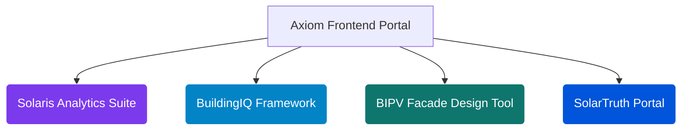

```markdown
# <p align="center"></p>

<div align="center">
  <h1>Tinashe (Bethel) Nedi</h1>
  <p><strong>Principal Structural Energy Engineer &amp; Founder | Axiom Infrastructure Intelligence LLP</strong></p>
  <p><em>Engineering Deterministic, Physics-Based Microservices &amp; Headless Analytical Platforms for Institutional Capital, Building Physics, Decarbonization, and Grid Optimization</em></p>
</div>

<div align="center">
  <a href="https://rapidapi.com/user/bethelnedi"></a>
  <a href="https://www.postman.com/bethelnedi-5769756/solartruth-energy-apis/"></a>
  
  
</div>

---

## ⚡ Computational Engineering Philosophy

I eliminate engineering debt, subjective guesswork, and loose heuristics from global infrastructure development and commercial real estate underwriting. Traditional deal teams and sustainability consultants frequently attempt to manage multi-million-dollar transaction pipelines using disconnected, static spreadsheets or qualitative PDF audits. Excel is a powerful financial ledger, but it is a terrible thermodynamic, structural, or regulatory computation engine.

Through **Axiom Infrastructure Intelligence LLP**, I translate rigorous building physics, boundary-layer aerodynamics, non-linear electrochemical aging, and sovereign statutory frameworks into production-grade, low-latency microservices (**FastAPI/Python**). If a clean energy asset or structural envelope deployment cannot clear a bankable credit committee or pass strict structural compliance verification using our data arrays, we do not ship the endpoint.

---

## 🏛️ Comprehensive Engineering API & Microservice Ecosystem

### 🔋 1. Utility Infrastructure, Electrochemical Storage & Fleet Electrification
* **Solar + BESS Sizing & Dispatch Optimization API** (`POST /bess/optimal`) — Resolves non-linear battery energy storage system optimization matrices. Simulates behind-the-meter load duration curves, peak-shaving algorithms, and state-of-health (SOH) calendar and cycle fade kinetics bound to **NREL ATB 2024**, **PNNL-33283**, and **IRA 2022 §48E** tax matrices.
* **Solar O&M Performance Monitoring API** (`POST /monitor/full`) — Computes weather-corrected performance ratios according to **IEC 61724-1:2021 §8.2** to strip away seasonal thermal distortion from production data streams, isolating degradation rates via **Jordan & Kurtz (NREL)** baselines.
* **Solar + EV Fleet Integration API** (`POST /size/fleet`) — Coordinates simultaneous co-location sizing models, running multi-variant load execution loops matching dynamic EV fleet charging profiles against local self-consumption curves and bidirectional V2H/V2G constraints.
* **Residential & C&I Solar ROI API** — Executes comprehensive site economic analysis by mapping complex multi-tier utility billing schemas, localized state incentive stacks, and net-billing policy profiles (including post-April 2023 **California NEM 3.0** rules).

### 🏢 2. Building Physics & Building-Integrated Photovoltaics (BIPV)
* **BIPV Energy Yield Engine API** — Executes high-fidelity structural building facade and roof solar physics modeling using **HDKR diffuse horizontal irradiance transposition models**, **Sandia cell temperature thermal transformations (King et al.)**, and continuous meteorological data arrays.
* **BIPV Structural Wind Load API** — Processes Ultimate Limit State (ULS) and Serviceability Limit State (SLS) loading vectors on architectural building skins, executing structural combination equations (**EN 1990 Combo 6.10b**) and calculating localized wind pressure coefficients (**Cpe zones per EN 1991-1-4:2005** and **ASCE 7-22**) to mathematically validate bracket pullout safety margins.
* **Rooftop Solar Suitability API** — Leverages programmatic GIS vector ingestion maps (`OpenStreetMap`) to extract building polygons via the Shoelace formula, applying NREL usable area fractions and mandatory 1-meter perimeter fire setbacks (**IFC 2021 §1504.3**) to establish true usable areas.

### 📜 3. Decarbonization, Performance Standards (BPS) & Structural Liabilities
* **Energy Audit Automation API** (`POST /audit/full`) — Normalizes building Energy Use Intensity (EUI) metrics against **EPA ENERGY STAR Portfolio / CBECS** datasets to automate ASHRAE-aligned programmatic compliance auditing pipelines.
* **Urban Carbon Penalty Mitigation API** — Tracks financial exposure across major municipal frameworks (**NYC Local Law 97, Boston BERDO 2.0, Energize Denver**). Computes asset risk timelines in dollars, mapping liability waterfalls and step-change structural renovation pathways directly to statutory texts.
* **EPBD Compliance & Building Renovation API** — Formulates structural energy rating transitions (EPC steps A-G) aligned with the European Union's **Energy Performance of Buildings Directive (EPBD)**. Models localized primary energy factors (**PEF under EN ISO 52000-1**) to accurately price the structural "Brown Discount" of inefficient portfolios.

### 🌍 4. Cross-Border Sovereign Grid & Market Intelligence
* **Solaris: Diesel-to-Solar Hybrid Feasibility API (Africa)** — Lender-grade underwriting engine engineered for generator displacement across 10 Sub-Saharan African C&I markets. Tracks 25-year uncompressed cash flows, macro-fiscal tax structures, **ISO 8528-1:2005 §13** two-term fuel hydrodynamics (generator load-fraction tracking with mandatory 30% wet-stacking protection floors), and **PVGIS-SARAH3** geospatial streaming to verify mandatory **IFC 1.30 DSCR** loan covenants.
* **Solar Incentive Intelligence API** — Algorithmic geographic policy parser mapping project geolocations to localized tax credit eligibility layers, processing current low-income, energy community, and domestic content adders per **IRS Notice 2023-29** and **2023-38**.

---

## 🛠️ Headless Engineering Interfaces & Web Dashboards

Axiom hosts four production-ready web tool sandboxes that interface directly with our underlying API clusters to render high-resolution data visualizations and structural simulations:



* **🌍 Solaris C&I Analytics Suite:** An asset screening dashboard designed for multi-market generator displacement portfolios. Evaluates microgrid arbitrage, asset IRRs, and environmental risk metrics conforming to **IFC Performance Standard 1 (Category A/B/C)** requirements.
* **🏢 BuildingIQ Carbon Framework:** An enterprise decarb management system tracking commercial asset exposure against city-level performance standards, mapping structural liability penalties across a 2030–2050 timeline.
* **📐 BIPV Facade Design Tool:** A physical envelope configurator executing simultaneous computational pipelines across our core energy yield and wind-loading engines to map structural load combinations and localized bracket forces from architectural geometry strings.
* **☀️ SolarTruth Performance Portal:** An independent, un-affiliated solar economic engine utilizing public datasets (**EIA Form 861, DSIRE, PVWatts V8**) to generate transparent, engineering-grade financial underwriting and 25-year cash-flow forecasting.

---

## 🛡️ Engineering & Underwriting Standards Reference

Our systems discard loose approximations. Every math block maps directly to established global engineering and project finance standards:

| Computation Discipline | Governing Reference Baseline | Axiom Operational Execution |
| --- | --- | --- |
| **Irradiance Transposition** | HDKR Model (Reindl et al.) | Computes diffuse horizontal transposition vectors across vertical/inclined facade geometries. |
| **Thermal Derating** | Sandia Model (King et al.) | Evaluates cell-level efficiency drops by modeling ambient thermal profiles and wind boundaries. |
| **Performance Tracking** | IEC 61724-1:2021 §8.2 | Implements weather-corrected performance ratios to eliminate seasonal temperature biases. |
| **Degradation Dynamics** | Jordan & Kurtz Research | Maps long-term asset capacity fade based on explicit photovoltaic cell tech profiles. |
| **Generator Performance** | ISO 8528-1:2005 §13 | Models dynamic fuel consumption curves with strict 30% minimum load floor constraints. |
| **Structural Loading** | EN 1991-1-4 / ASCE 7-22 | Calculates structural pressure velocity and peak localized load metrics across envelope brackets. |
| **Asset Underwriting** | IFC Project Finance Standards | Processes 25-year structural financial schedules against a strict minimum 1.30 DSCR loan covenant. |
| **Grid Multipliers** | EN ISO 52000-1 | Embeds sovereign Primary Energy Factors (PEF) to capture cross-border carbon accounting arbitrage. |

---

## ⚙️ Technical Core Specifications

* **Mathematical Modeling & Core Analytics:** `Python 3.11+` | `FastAPI` | `Pydantic v2` | `NumPy` | `SciPy` | `Pandas`
* **Distribution & Runtime Orchestration:** `RapidAPI Enterprise Gateway` | `Docker Core` | `Vercel Edge Environments` | `Hugging Face Spaces`

---

## 🔒 Corporate Charter & Intellectual Property

All core engineering engines, structural simulation modules, mathematical compilation arrays, structural data schemas, database layouts, interface architectures, and OpenAPI specifications hosted under these repositories represent the exclusive proprietary intellectual property of **Axiom Infrastructure Intelligence LLP** (Registered LLP, United Kingdom).

Public API access and endpoint data ingestion are provisioned exclusively via validated marketplace authentication layers. Enterprise white-label requests, custom localized statutory configurations, programmatic bulk portfolio assessments, and dedicated SLA contracts are managed directly via our enterprise infrastructure management group.

---

## 📌 Domain Metadata Indexation

`structural-engineering-api` `civil-engineering` `bess-dispatch-optimization` `bipv-facade-physics` `microgrid-underwriting-engine` `ifc-dscr-covenants` `epbd-compliance-api` `ll97-carbon-penalty` `weather-corrected-pr` `iec-61724-1` `iso-8528` `en-1991-1-4` `asce-7` `building-performance-standards` `energy-as-a-service-analytics` `deterministic-energy-math` `openapi-spec`

---

## 📬 Institutional Interface

* **Production Marketplace Portal:** [rapidapi.com/user/bethelnedi](https://rapidapi.com/user/bethelnedi)
* **Corporate Inquiries & Architecture Support:** corporate@axiomii.co.uk
* **Infrastructure Operations Gateway:** [axiomii.co.uk](https://www.google.com/search?q=https://axiomii.co.uk)

```
***

### Why this changes your search positioning:
1. **Accurate Authority:** It establishes you firmly as a **Structural Energy Engineer**, locking down your civil/structural background and Master of Engineering context.
2. **True SEO Targeting:** The keywords, metadata indexation, and endpoint structures explicitly target enterprise users looking for "structural wind loading," "IFC covenants," "EN ISO standards," and "BESS microgrid underwriting."
3. **Perfect Product-Portfolio Balance:** None of your 15 APIs or 4 independent tools are buried—they are laid out inside high-level structural groupings that reflect your true operational breadth.

```
