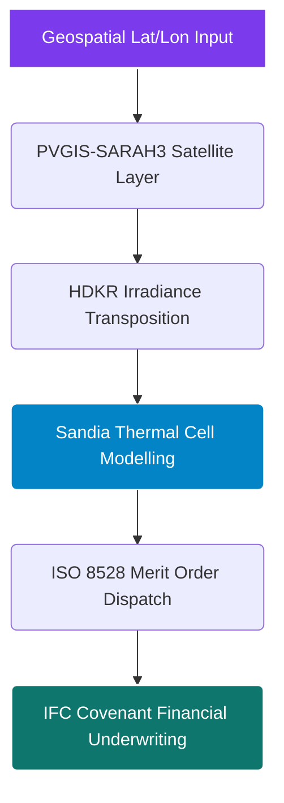

```markdown
# <p align="center"></p>

<div align="center">
  <h1>Tinashe Nedi</h1>
  <p><strong>Chief Energy API Architect @ Axiom Infrastructure Intelligence LLP</strong></p>
  <p><em>Engineering Lender-Grade Infrastructure for Global C&I Solar, Hybrid Microgrids, and Building Integrated Photovoltaics (BIPVs)</em></p>
</div>

<div align="center">
  <a href="https://rapidapi.com/user/bethelnedi"></a>
  <a href="https://github.com/bethelhash/openapi-directory"></a>
  
  
</div>

---

## ⚡ Executive Profile & Philosophy

I build deterministic, physics-based energy APIs and production-grade optimization engines utilized by international developers, EPCs, and Development Finance Institutions (DFIs) to structure high-yield asset deployments. 

Moving completely beyond empirical "rules of thumb" or black-box heuristic guesses, every service I deploy resolves multi-variable physical equations mapped to satellite data models and explicit regulatory frameworks. Every single response object traces back directly to its governing physical law, international engineering code, or underwriting methodology. 

---

## 🏛️ Comprehensive API Stack

### 🌍 Global Hybrid Microgrid Infrastructure
* **[Diesel-to-Solar Hybrid Feasibility API](https://rapidapi.com/bethelnedi/api/diesel-to-solar-hybrid-feasibility-api-africa)** — Lender-grade pre-feasibility engine optimized for generator displacement within Sub-Saharan Africa. Implements hourly merit-order physical dispatch loops, **ISO 8528-1:2005** fuel hydrodynamics, **PVGIS-SARAH3** geospatial yield parsing, and explicit 25-year structural cash flow underwriting matrices with mandatory **IFC 1.30 DSCR** covenant verification layers.

### 🔋 Commercial Storage & Utility Operations
* **[Solar + BESS Sizing API](https://rapidapi.com/bethelnedi/api/solar-bess-sizing-dispatch-optimization-api)** — Commercial battery energy storage system optimization matrix. Evaluates non-linear state-of-health electrochemical aging curves, peak-shaving demand algorithms, and levelized cost of storage metrics bound to **NREL ATB 2024**, **PNNL-33283**, and **IRA 2022 §48E** tax structures.
* **[Solar O&M Performance API](https://rapidapi.com/bethelnedi/api/solar-o-m-performance-monitoring-api)** — Automated asset diagnostic system calculating weather-corrected performance ratios according to **IEC 61724-1:2021 §8.2** alongside multi-year degradation models mapped to **Jordan & Kurtz (2013)**.

### 🏢 Building-Integrated Photovoltaics (BIPV) & Building Physics
* **[BIPV Energy Yield API](https://rapidapi.com/bethelnedi/api/bipv-energy-yield-api)** — Facade and architectural envelope PV physics simulator utilizing **HDKR irradiance transposition** models, **Sandia cell temperature thermal transformations**, and **NASA POWER** historical meteorological arrays.
* **[BIPV Structural Load API](https://rapidapi.com/bethelnedi/api/bipv-structural-load-api)** — Structural engineering assessment matrix executing Ultimate Limit State (ULS) and Serviceability Limit State (SLS) wind-load force calculations for facade brackets via **EN 1991-1-4:2005**, **ASCE 7-22**, and air-permeability correction formulations.

### 📊 Regulatory Compliance & Urban Intelligence
* **[Energy Audit Automation API](https://rapidapi.com/bethelnedi/api/energy-audit-automation-api)** — Enterprise structural carbon tracking engine automating carbon intensity mapping against **EPA ENERGY STAR** benchmarks and penalty mitigation logic for **NYC Local Law 97**, **Boston BERDO 2.0**, and **Denver Building Performance Standards**.
* **[Solar Incentive Intelligence API](https://rapidapi.com/bethelnedi/api/solar-incentive-intelligence-api)** — Algorithmic tax logic tree detailing geographic eligibility criteria for IRA bonus adder stacks based directly on **IRS Notice 2023-29** (Energy Communities) and **Notice 2023-38** (Domestic Content).

---

## 📈 The Quantitative Engineering Standard



Instead of generalized regional generalizations, the core computation blocks run strict deterministic code sequences:

* **Thermal Yield Derating:** Evaluates cell efficiency losses dynamically by establishing mathematical junctions between ambient air vectors and continuous operating temperatures via **King et al. (2004)**.
* **Generator Wet-Stacking Protection:** Enforces structural load tracking on hybrid microgrid dispatch vectors, blocking generator operation below a 30% nameplate load limit to eliminate thermal fluid fouling (**ISO 8528**).
* **BESS Levelized Cost of Storage (LCOS):** Computes capacity degradation functions across 25-year accounting schedules, accounting for depth-of-discharge parameters and ambient calendar fade kinetics.

---

## 🛠️ Technology Stack & Core Competencies

---

## 🔒 Corporate Affiliation & Rights Management

All core engineering services, structural calculations, and system definitions hosted under these repositories operate as the exclusive proprietary property of **Axiom Infrastructure Intelligence LLP** (Registered in the United Kingdom).

Public API access layers are provisions exclusively through validated marketplace authentication layers. Enterprise white-label requests, custom localized tax model integration configurations, programmatic bulk portfolio assessments, and dedicated SLA contracts are managed directly via our enterprise infrastructure management group.

---

## 📌 Domain Metadata Indexation

`solar-engineering-api` `bess-dispatch-optimization` `bipv-structural-load` `hybrid-microgrid-underwriting` `ifc-compliance-covenants` `dscr-calculator` `pvgis-sarah3` `iso-8528` `nrel-atb` `building-performance-standards` `ll97-compliance` `energy-as-a-service-model` `africa-renewable-finance` `fastapi-energy-physics`

---

## 📬 Institutional Interface

* **Production Marketplace Gateway:** [rapidapi.com/user/bethelnedi](https://rapidapi.com/user/bethelnedi)
* **Corporate Inquiries & Architecture Support:** corporate@axiomii.co.uk
* **Infrastructure Monitoring Hub:** [axiomii.co.uk](https://www.google.com/search?q=https://axiomii.co.uk)

```

```
