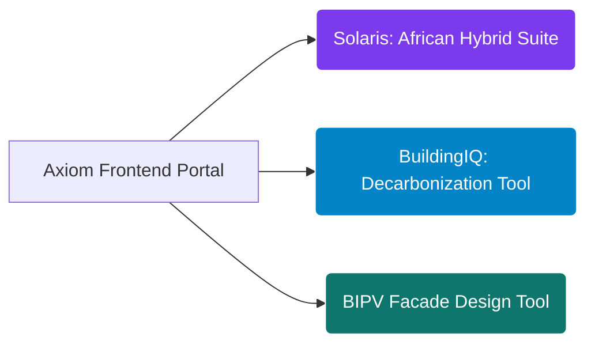

# <p align="center"></p>

<div align="center">
  <h1>Tinashe Nedi</h1>
  <p><strong>Founder &amp; Principal Energy Software Engineer | Axiom Infrastructure Intelligence LLP</strong></p>
  <p><em>Engineering Deterministic, Physics-Based APIs &amp; Enterprise Analytics for Global Project Finance, Building Physics, and Decarbonization</em></p>
</div>

<div align="center">
  <a href="https://rapidapi.com/user/bethelnedi"></a>
  <a href="https://github.com/bethelhash/openapi-directory"></a>
  
  
</div>

---

## ⚡ Executive Brief & Computational Philosophy

I design and deploy deterministic, production-grade physics APIs and energy intelligence platforms for institutional solar developers, Energy Service Companies (ESCOs), grid operators, and project finance underwriters. 

Axiom Infrastructure Intelligence completely replaces black-box empirical heuristics, software vendor lock-in, and error-prone engineering spreadsheets. Every calculation block exposed by our engines executes rigorous math—solving multi-variable physical vectors, non-linear electrochemical aging loops, and localized macro-fiscal structures in **under 500ms**. Every response payload explicitly references its governing physical laws, international testing codes, or statutory compliance definitions. If an energy asset cannot be underwritten by a credit committee using our data arrays, we do not ship the endpoint.

---

## 🏛️ Unified Enterprise API Ecosystem

### 🔋 1. Utility Infrastructure & Energy Storage Optimizers
* **[Solar + BESS Sizing & Dispatch Optimization API](https://rapidapi.com/bethelnedi/api/solar-bess-sizing-dispatch-optimization-api)** — Resolves non-linear battery energy storage system optimization matrices. Models peak-shaving demand algorithms, dynamic TOU arbitrage routines, and levelized cost of storage (LCOS) variables bound tightly to **NREL ATB**, **PNNL-33283**, and **IRA 2022 §48E** specifications.
* **[Solar O&M Performance Monitoring API](https://rapidapi.com/bethelnedi/api/solar-o-m-performance-monitoring-api)** — Computes weather-corrected performance ratios according to **IEC 61724-1:2021 §8.2** to strip away seasonal thermal distortion vectors, generating real-time anomaly isolation algorithms and multi-year degradation models via **Jordan & Kurtz**.
* **[Solar + EV Sizing & Integration API](https://rapidapi.com/bethelnedi/api/solar-ev-integration-sizing-api)** — Coordinates simultaneous sizing frameworks for fleet co-location, balancing localized dynamic EV load behaviors against solar self-consumption loops and bidirectional V2H/V2G discharge constraints.

### 🏢 2. Building Physics & Building-Integrated Photovoltaics (BIPV)
* **[BIPV Energy Yield Engine API](https://rapidapi.com/bethelnedi/api/bipv-energy-yield-api)** — Executes high-fidelity structural building facade and roof solar physics modeling using **HDKR irradiance transposition models**, **Sandia cell temperature thermal equations (King et al.)**, and continuous meteorological satellite grid streaming.
* **[BIPV Structural Wind Load API](https://rapidapi.com/bethelnedi/api/bipv-structural-load-api)** — Resolves Ultimate Limit State (ULS) and Serviceability Limit State (SLS) loading vectors on solar building skins and structural envelope brackets, utilizing **EN 1991-1-4:2005**, **ASCE 7-22**, and air-permeability correction factors.
* **[Rooftop Solar Suitability API](#)** — Leverages programmatic open-source GIS polygon ingestion maps (`OpenStreetMap`) to evaluate usable structural surface areas, macro-shading obstructions, and directional azimuth scores from a single target geolocation coordinate.

### 🌍 3. Cross-Border Sovereign Grid & Market Intelligence
* **[Solaris: Diesel-to-Solar Hybrid Feasibility API (Africa)](https://rapidapi.com/bethelnedi/api/diesel-to-solar-hybrid-feasibility-api-africa)** — Lender-grade underwriting engine purpose-built for generator replacement projects across 10 Sub-Saharan African C&I markets. Tracks 25-year uncompressed cash flows, macro-fiscal tax structures, **ISO 8528-1:2005** fuel hydrodynamics, and continuous **PVGIS-SARAH3** geospatial yield maps to verify mandatory **IFC 1.30 DSCR** loan covenants.
* **[Solar Incentive Intelligence API](https://rapidapi.com/bethelnedi/api/solar-incentive-intelligence-api)** — Algorithmic geographic policy parser mapping project locations to localized tax credit eligibility layers, processing current low-income, energy community, and domestic content adders per **IRS Notice 2023-29** and **2023-38**.
* **[Residential Solar ROI & Net Metering API](https://rapidapi.com/bethelnedi/api/residential-solar-roi-api)** — Resolves complex consumer financial models across fragmented policy definitions (including NEM 3.0), utilizing **NREL PVWatts v8** and live utility tariff schedules.

### 📜 4. Decarbonization & Building Performance Standards (BPS)
* **[Energy Audit Automation API](https://rapidapi.com/bethelnedi/api/energy-audit-automation-api)** — Normalizes building Energy Use Intensity (EUI) against **EPA ENERGY STAR** datasets to automate ASHRAE-aligned audit tracking pipelines.
* **[Urban Carbon Penalty Mitigation API](#)** — Programmatically tracks exposure to carbon emissions penalties, calculating multi-period asset exposure in dollars and mapping compliance roadmaps directly to regulatory texts (**NYC Local Law 97**, **Boston BERDO 2.0**, and **Denver BPS** regulations).
* **[EPBD Compliance & Building Renovation API](#)** — Formulates structural energy rating tracks (EPC A-G steps) mapped to the European Union's **Energy Performance of Buildings Directive (EPBD)** framework, modeling cost-optimal solar offsets required to achieve zero-emission building mandates.

---

## 🛠️ Enterprise Software Tools & Core Engines

Axiom hosts three headless production tool web interfaces that interact directly with our underlying API clusters to process high-resolution user interactions:



---

### 🌍 Solaris C&I Analytics Suite

An independent investment analytics dashboard focusing on multi-market generator displacement portfolios. Leverages the `Solaris Engine` to model structural microgrid arbitrage, track cross-border asset IRRs, generate environmental risk categorization matrix indices conforming to **IFC Performance Standard 1 (Category A/B/C)**, and check eligibility boundaries against DFI criteria.

### 🏢 BuildingIQ: Global Carbon Compliance Framework

An enterprise decarb management system tracking corporate real estate assets against structural city-level performance standards. Ingests operational baseline loads, tracks structural risk penalties across a 2030–2050 timeline, and exposes multi-variable renewable mitigation paths with clear regulatory citations.

### 📐 BIPV Facade Design Tool

A physical envelope configurator executing simultaneous computational pipelines across our core energy yield and wind-loading engines. Calculates localized annual kilowatt-hour metrics, weather-corrected performance ratios, **EN 1990 structural load combinations**, and mechanical bracket stresses from a single architectural geometry array.

---

## 🛡️ Rigorous Engineering Standards Matrix

Our engineering core has zero room for black boxes or generic assumptions. Every function block maps to an authenticated engineering baseline:

| Computation Category | Governing Code / Reference | Axiom Operational Execution |
| --- | --- | --- |
| **Irradiance Transposition** | HDKR Model (Reindl et al.) | Evaluates multi-angle diffuse horizontal transposition vectors across facades. |
| **Thermal Derating** | Sandia Model (King et al.) | Calculates active module cell temperatures based on ambient heat and wind. |
| **Weather Monitoring** | IEC 61724-1:2021 | Calculates true weather-corrected performance ratios to remove seasonal bias. |
| **Degradation Kinematics** | Jordan & Kurtz Research | Maps long-term capacity fade curves based on explicit cell tech profiles. |
| **Generator Performance** | ISO 8528-1:2005 §13 | Implements two-term diesel fuel curve tracking with mandatory 30% load floors. |
| **Structural Loading** | EN 1991-1-4:2005 / ASCE 7-22 | Processes velocity pressures and peak load distributions across building panels. |
| **Lender Underwriting** | IFC Project Finance Standards | Assesses structural annual debt capabilities against a strict minimum 1.30 DSCR. |
| **Carbon Accounting** | Verra VCS / Gold Standard | Compiles traceable emission metrics to support compliance-grade registry submissions. |

---

## ⚙️ Technical Architecture & Stack Specs

---

## 🔒 Corporate Charter & Intellectual Property Rights

All engineering software engines, structural model logic trees, mathematical compilation arrays, database layouts, interface architectures, and OpenAPI specifications deployed across these repositories represent the exclusive proprietary intellectual property of **Axiom Infrastructure Intelligence LLP** (Registered LLP, United Kingdom).

Public endpoint ingestion is managed exclusively via verified authentication keys issued through our marketplace gateways. Custom localized financial setups, programmatic large-scale portfolio evaluations, white-label API cluster deployments, and guaranteed enterprise SLA contracts are arranged directly through our primary structural operations division.

---

## 📌 Domain Metadata Indexation

`solar-engineering-api` `bess-sizing-optimization` `bipv-facade-physics` `microgrid-underwriting-engine` `ifc-dscr-covenants` `epbd-compliance-api` `ll97-carbon-penalty` `weather-corrected-pr` `iec-61724-1` `iso-8528` `nrel-atb` `building-performance-standards` `energy-as-a-service-analytics` `deterministic-energy-math`

---

## 📬 Enterprise & Architecture Interface

* **Production Marketplace Portal:** [rapidapi.com/user/bethelnedi](https://rapidapi.com/user/bethelnedi)
* **Architectural Support & Licensing Inquiries:** corporate@axiomii.co.uk
* **Infrastructure Operations Gateway:** [axiomii.co.uk](https://www.google.com/search?q=https://axiomii.co.uk)

```

```
